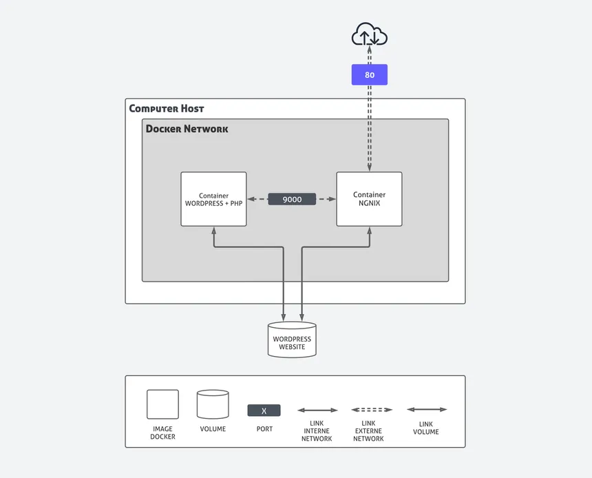

# Inception

## Description
This project aims to broaden your knowledge of system administration by using Docker. You will virtualize several Docker images, creating them in a new personal virtual machine. The project requires setting up a small infrastructure composed of different services using Docker Compose.



### Key Components
- **Nginx**: Web server with TLS encryption (SSL/TLS)
- **WordPress + PHP-FPM**: Blog/CMS platform
- **MariaDB**: Database server
- **Redis**: Cache server (optional)
- **Adminer**: Database management tool (optional)
- **Static Website**: Basic HTML/CSS website

## Instructions

### Prerequisites
- Docker
- Docker Compose
- GNU Make

### Quick Start
1. Clone the repository:
   ```bash
   git clone <repository-url>
   cd inception
   ```

2. Build and start the services:
   ```bash
   make
   ```

3. Access the services:
   - Website: https://zsaghir.42.fr

### Available Make Commands
- `make`: Build and start all services
- `make build`: Build the services
- `make up`: Start the services
- `make down`: Stop and remove containers
- `make clean`: Remove all containers and volumes
- `make fclean`: Reset everything (containers, volumes, networks)
- `make re`: Rebuild everything from scratch

## Resources

### Documentation
- [Docker Documentation](https://docs.docker.com/)
- [Docker Compose Documentation](https://docs.docker.com/compose/)
- [Nginx Documentation](https://nginx.org/en/docs/)
- [WordPress Documentation](https://wordpress.org/support/)
- [MariaDB Documentation](https://mariadb.com/kb/en/documentation/)

### AI Assistance
This project utilized AI assistance for:
- Initial project structure setup
- Docker configuration and optimization
- Documentation generation
- Troubleshooting common issues

## Project Design

### Virtual Machines vs Docker
- **Virtual Machines**: Full OS emulation, higher resource usage, slower startup times, complete isolation
- **Docker**: OS-level virtualization, lightweight, fast startup, process isolation, better resource sharing

### Secrets vs Environment Variables
- **Environment Variables**: Suitable for non-sensitive configuration, stored in plaintext
- **Docker Secrets**: Encrypted at rest and in transit, better for sensitive data like passwords and API keys

### Docker Network vs Host Network
- **Docker Network**: Default networking mode, containers get their own network namespace, better isolation
- **Host Network**: Containers share the host's network stack, higher performance but less isolation

### Docker Volumes vs Bind Mounts
- **Docker Volumes**: Managed by Docker, stored in the Docker storage directory, better for production
- **Bind Mounts**: Directly mount host directories, useful for development, but less portable

## License
This project is part of the 42 curriculum and is available for educational purposes only.
